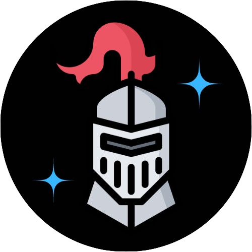

<div align="center">
  
  <H1>Knightstar Server 🌟🛡️</H1>
  Welcome to <b>Knightstar Server</b>, your shining protector in the world of digital communication!<br/>
  Knightstar is an end-to-end encrypted chat application, ensuring your conversations remain private and secure. 🗝️🔒
</div>

## Getting Started 🚀

These instructions will get you a copy of the project up and running on your local machine for development and testing purposes. See deployment for notes on how to deploy the project on a live system.

## MakeFile 🏗️

run all make commands with clean tests
```bash
make all build
```

build the application
```bash
make build
```

run the application
```bash
make run
```

Create DB container
```bash
make docker-run
```

Shutdown DB container
```bash
make docker-down
```

live reload the application
```bash
make watch
```

run the test suite
```bash
make test
```

clean up binary from the last build
```bash
make clean
```

kill process on UNIX port
```bash
make port=8080 kill-port
```

## Credits 🙏

- The beautiful logo of Knightstar was created using [Canva](https://www.canva.com/). 🎨🖌️
- An element of the icon was created by [Nikita Golubev](https://twitter.com/lastspark_ng) and published on [Flaticon](https://www.flaticon.com/authors/nikita-golubev). 🛡️🌟
- The initial project structure was created using the [Go Blueprint](https://go-blueprint.dev/) project. 🏗️📝


## Contribute 🤝

We welcome contributions from the community. Feel free to open an issue or submit a pull request! 💡🔧

## License 📄

Knightstar Server is licensed under the [BSD-4-Clause](https://en.wikipedia.org/wiki/BSD_licenses) License. See [`LICENSE`](./LICENSE) for more information. 📜
